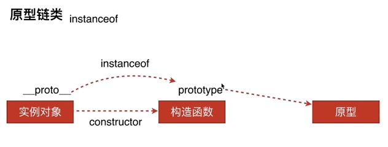
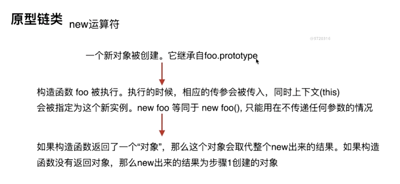

## 创建对象的几种方式

### 字面量

```js
var o1 = {name: 'o1'};
var o2 = new Object({name: 'o2'});
```

### 构造函数

```js
var M = function (name) { this.name = name; };
var o3 = new M('o3');
```

### Object.create

```js
var p = {name: 'p'};
var o4 = Object.create(p);

M.prototype.say = function () {
    console.log('say hi');
};
var o5 = new M('o5');


var new2 = function (func) {
    var o = Object.create(func.prototype);
    var k = func.call(o);
    if (typeof k === 'object') {
        return k;
    } else {
        return o;
    }
};
```

## instanceof 原理

先来看一张图



```js
var M = function (name) { this.name = name; };
var o3 = new M('o3');
```

此时我们来判断一下：

    o3.__proto__ === M.prototype
    // true
    M.prototype.__proto__ === Object.prototype
    // true

上面的方式就是instansof的依据

    o3 instanceof M
    // true
    o3 instanceof Object
    // true

但是，有时候我们o3继承自o2，o2继承自o1，我们想判断o3由谁直接实例而来，怎么做呢？这个时候只能靠constructor.

    o3.constructor === M
    // true
    o3.constructor === Object
    // false

这个时候我们就可以很清楚的看到，o3是由M实例而来的。

## new运算符

首先观察一下new执行之后所做的事情



接下来我们来自己实现一下new的简单实现

```js
function New(fn) {
  var f = Object.create(fn.prototype)
  var o = fn.call(f)
  if (typeof o === 'object') {
      return o
  } else {
      return f
  }
}
```