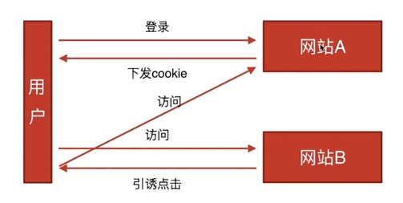

## CSRF

### 基本概念和缩写

CSRF， 跨站请求伪造，英文Cross-site request forgery

### 攻击原理

一个用户访问A网站，登陆成功获取cookie。然后再去登陆B网站，B网站有一个引诱点击按钮，点击之后回向A网站请求APi，浏览器自动带上cookie，那么A网站就会认为这个请求是通过的。

### 防御措施

* token验证
* referer验证
* 隐藏令牌

#### token验证

用户登陆成功之后，服务器给用户下发一个token。浏览器访问一个APi时，会自动带上cookie，但是不会带上token。

#### referer验证

判断页面来源。

#### 隐藏令牌

跟token有点像，只不过是放在http head中，比较隐蔽。

## XSS

### 基本概念和缩写

XSS，跨域脚本攻击，英文cross-site scripting

### 攻击原理

向页面注入脚本

### 防御措施

核心办法是让脚本无法执行