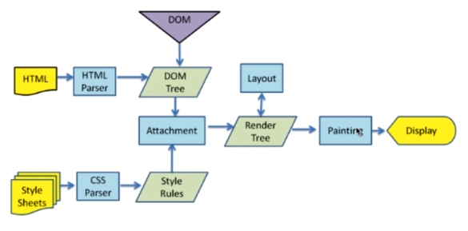

## 什么是DOCTYPE及作用

    DTD(文档类型定义)， DTD告诉浏览器我是哪一种文档类型，你用什么引擎来解析我。
    DTCTYPE是用来声明文档类型和DTD规范的，告诉浏览器当前文档包含哪一种DTD也就是哪一种文档类型。

## 浏览器的渲染过程

HTML Tree + CSSOM Tree --> Render Tree --> Layout --> Painting