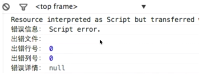

## 前端错误的分类

1. 即时运行错误： 代码错误
2. 资源加载错误

## 错误的捕获方式

### 即时运行错误

1. try...catch
2. window.onerror

### 资源加载错误

1. object.onerror: 对标签绑定事件，资源加载错误不会冒泡到window.onerror
2. performance.getEntries(): 返回一个数组，包含页面加载的资源连接
3. error事件捕获： 资源加载错误不会冒泡，但是可以捕获

error事件捕获例子：

```html
<!DOCTYPE html>
<html>
  <head>
    <meta charset="utf-8">
    <title>错误监控</title>
    <script type="text/javascript">
      window.addEventListener('error', function (e) {
          console.log('捕获', e);
      }, false);
    </script>
  </head>
  <body>
    <script src="//badu.com/test.js" charset="utf-8"></script>
  </body>
</html>
```

跨域的js运行错误可以捕获吗？错误提示是什么，应该怎么处理？



我们可以看到，我们只能得到 `Script error`这个提示，错误行号和错误信息都没有。

怎么处理呢？

1. 在script标签添加crossorigin属性
2. 设置js资源响应头Access-Control-Allow-Origin:*

## 上报错误的基本原理

1. 采用Ajax通信的方式上报（不推荐）
2. 利用Image对象上报（推荐）

利用Image对象上报：

```html
<script type="text/javascript">
  (new Image()).src = 'http://baidu.com/tesjk?r=tksjk';
</script>
```